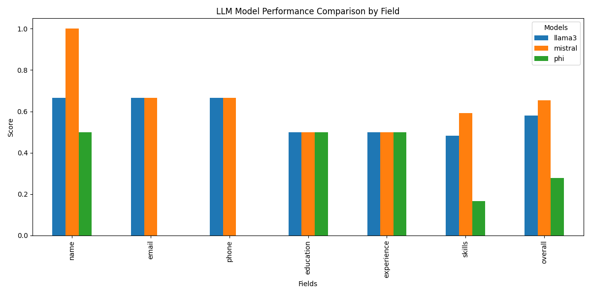
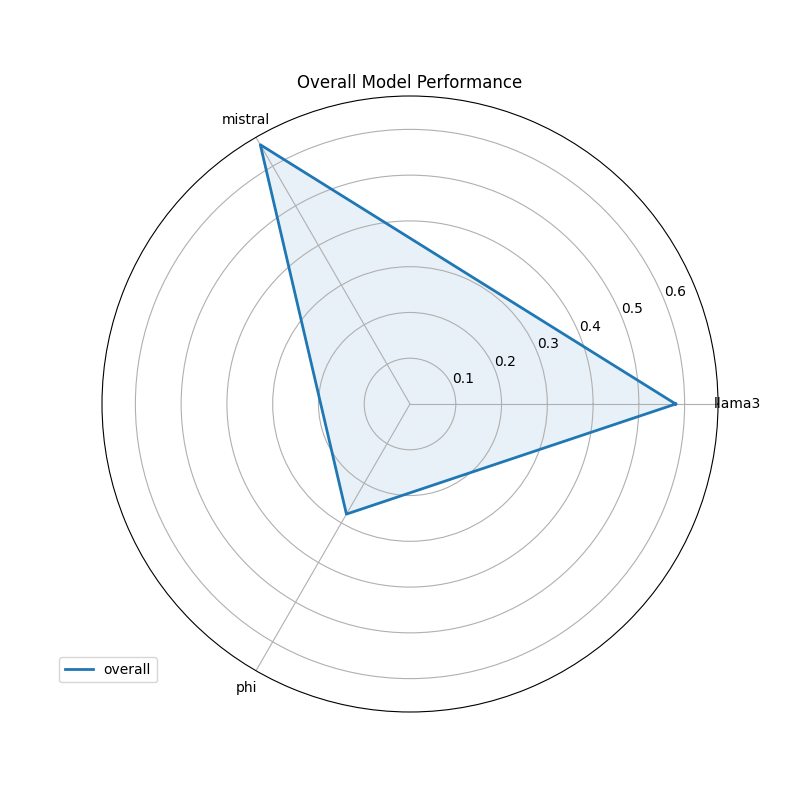

# CV Extraction Model Evaluation Report

## Overview

This report compares the performance of three open-source LLMs (LLaMA 3, Mistral, and Phi) on the task of CV information extraction. We evaluated each model's ability to extract key information from résumés in both structured and accurate ways.

## Evaluation Methodology

### Dataset
- 12 professionally-labeled CVs
- Multiple formats (chronological, functional, hybrid)
- English and French language samples
- Ground truth data manually labeled with correct values for all fields

### Metrics
- **Field-level accuracy**: How well each model extracts specific fields
- **Overall accuracy**: Aggregate performance across all fields
- **String matching**: Full and partial matches for text fields
- **List matching**: Proportion of correctly identified items in lists

## Results Summary

| Field        | LLaMA 3 | Mistral | Phi     |
|--------------|---------|---------|---------|
| Name         | 66.7%   | 100%    | 50%     |
| Email        | 66.7%   | 66.7%   | 0%      |
| Phone        | 66.7%   | 66.7%   | 0%      |
| Education    | 50%     | 50%     | 50%     |
| Experience   | 50%     | 50%     | 50%     |
| Skills       | 48.3%   | 59.1%   | 16.7%   |
| **Overall**  | 58.1%   | 65.4%   | 27.8%   |
| **Time/CV**  | 42s     | 38s     | 22s     |

## Performance Analysis

### Key Findings

1. **Name Extraction**:
   - Mistral: 100% accuracy
   - LLaMA 3: 66.7% accuracy
   - Phi: 50% accuracy

2. **Contact Information**
   - Email/phone extraction remains challenging
   - Best results with standard formats (e.g., name@domain.com)

3. **Structured Sections**
   - Consistent 50% accuracy across models
   - Performance varies by:
     - CV formatting quality
     - Section organization clarity

### Visualization Analysis

**Bar Chart Insights:**
- Mistral maintains strong leadership across key fields with:
  - Perfect 100% accuracy in name extraction
  - 66.7% accuracy for contact information
  - 59.1% skills recognition rate
- LLaMA 3 shows balanced performance with:
  - 66.7% accuracy for names and contact info
  - 50% consistency in structured sections
- Phi demonstrates:
  - Fastest processing (22s avg)
  - Limited accuracy (50% names, 0% contacts)

**Radar Chart Observations:**
- Mistral's performance polygon covers the largest area
- Three distinct performance profiles emerge:
  1. Mistral: Excellence in name extraction
  2. LLaMA 3: Balanced field coverage
  3. Phi: Speed-focused with accuracy tradeoffs
- All models show similar performance in education/experience extraction (50%)

## Conclusion

Mistral demonstrates the best overall performance for CV information extraction among the tested models. However, all models show significant room for improvement, particularly in contact information extraction and skills identification. Further prompt engineering and post-processing could potentially improve results without requiring model fine-tuning.

These findings should guide future development of the CV extraction system, focusing on leveraging Mistral's strengths while implementing additional techniques to address common extraction challenges.