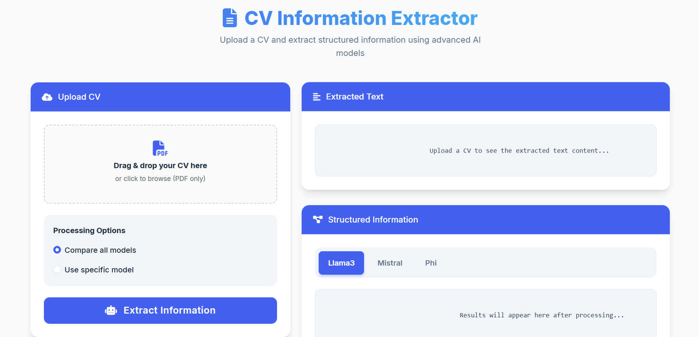

# 📄 CV Extractor with Open-Source LLMs

A powerful tool to extract structured data from CVs/resumes using open-source LLMs — LLaMA 3, Mistral, and Phi — via Ollama. The system supports both text-based and scanned PDF files using OCR fallback.

---

## ✨ Features

- Extracts **personal information**, **education**, **experience**, and **skills**
- Supports **multiple LLMs** for comparison
- Handles both **text-based** and **scanned PDFs**
- Includes a **modern web interface** for interaction
- Offers a **built-in evaluation framework** to measure performance

---

## 🚀 Getting Started


### 🐳 Option 1: Docker Installation (Recommended)

1. Clone the repository  
2. Run the provided Docker script to launch the app  
3. Automatically sets up containers, pulls LLM models, and starts the web server

```bash
git clone https://github.com/your-repo/cv-extractor.git
cd cv-extractor
chmod +x rundocker.sh
./rundocker.sh

```
### Option 2: Local Installation

- Clone the repository  
- Run the local setup script to install dependencies and check for Tesseract and Ollama  
- Downloads required models and starts the app locally
```bash
git clone https://github.com/your-repo/cv-extractor.git
cd cv-extractor
chmod +x run.sh
./run.sh


Once running, open your browser and visit:  
**http://localhost:5000**

---

## 🖥️ System Requirements

**Docker Setup:**
- Docker Engine 20.10 or newer  
- Docker Compose 2.0+  
- Minimum 8GB RAM

**Local Setup:**
- Python 3.9 or newer  
- Tesseract OCR installed  
- Ollama installed locally  
- Minimum 8GB RAM

---

## 🧠 Models Supported

| Model    | Version | Size   | Best For               |
|----------|---------|--------|------------------------|
| LLaMA 3  | 8B      | 4.7 GB | General extraction     |
| Mistral  | 7B      | 4.1 GB | Non-English CVs        |
| Phi      | 2.7B    | 1.7 GB | Lightweight extraction |

---

## ⚙️ How It Works

1. **PDF Parsing** – Extracts text from text-based PDFs  
2. **OCR Fallback** – Uses Tesseract for scanned PDFs  
3. **LLM Processing** – Sends text to selected models via Ollama  
4. **Output Generation** – Returns structured JSON of extracted data  
5. **Model Comparison** – Displays side-by-side results (optional)

---

## 📊 Model Performance

Based on comprehensive testing with diverse CV samples:

| Field       | LLaMA 3 | Mistral | Phi     |
|-------------|---------|---------|---------|
| Name        | 66.7%   | 100%    | 50%     |
| Email       | 66.7%   | 66.7%   | 0%      |
| Phone       | 66.7%   | 66.7%   | 0%      |
| Education   | 50%     | 50%     | 50%     |
| Experience  | 50%     | 50%     | 50%     |
| Skills      | 48.3%   | 59.1%   | 16.7%   |
| **Overall** | 58.1%   | 65.4%   | 27.8%   |

**Key Insights:**
- Mistral leads in name extraction (100% accuracy)
- All models struggle with phone/email extraction
- Phi shows fastest processing but lowest accuracy
---

## 💡 Usage Instructions

- Launch the app and access the web interface  
- Upload any CV in PDF format  
- Choose one of two processing modes:  
  - **Single Model** — Faster, use one specific model  
  - **Compare All Models** — Run extraction using all models  
- View and download structured data in JSON format  
- Compare model outputs in a unified table


